# 🧩 Ứng dụng giải toán 8-Puzzle bằng các thuật toán Trí tuệ Nhân tạo

Chào mừng bạn đến với dự án "8-Puzzle Solver" - một ứng dụng trực quan hóa quá trình giải bài toán 8-Puzzle (Xếp hình 8 số) bằng nhiều thuật toán tìm kiếm khác nhau trong lĩnh vực Trí tuệ Nhân tạo.

## 1. Mục tiêu Dự án

Mục tiêu chính của dự án này là:
*   Xây dựng một ứng dụng đồ họa (GUI) cho phép người dùng tương tác với bài toán 8-Puzzle.
*   Triển khai và tích hợp đa dạng các thuật toán tìm kiếm (cả tìm kiếm mù, tìm kiếm có thông tin, tìm kiếm cục bộ, v.v.) để giải quyết bài toán.
*   Cung cấp khả năng trực quan hóa (animation) từng bước di chuyển của lời giải tìm được trên bảng Puzzle.
*   Xây dựng các công cụ visualization đặc thù cho các thuật toán phức tạp (như cây AND-OR cho AND-OR Search).
*   Lưu trữ và hiển thị lịch sử chạy thuật toán để so sánh hiệu suất.
*   Tạo ra một nền tảng giúp học hỏi và so sánh hiệu quả của các thuật toán AI khác nhau trên cùng một bài toán mẫu.

## 2. Nội dung Chính

Dự án bao gồm việc triển khai và trực quan hóa các nhóm thuật toán sau:

### 2.1. Bài toán 8-Puzzle: Thành phần và Lời giải

*   **Bài toán 8-Puzzle:** Là một bài toán tìm kiếm trạng thái cổ điển. Trạng thái của bài toán được biểu diễn bằng một ma trận 3x3 chứa 8 số (từ 1 đến 8) và một ô trống (biểu diễn bằng 0).
*   **Các thành phần chính:**
    *   **Trạng thái:** Ma trận 3x3 hiện tại của bảng Puzzle.
    *   **Hành động:** Các thao tác di chuyển ô trống: Lên (UP), Xuống (DOWN), Sang trái (LEFT), Sang phải (RIGHT). Các hành động chỉ hợp lệ nếu ô trống có thể di chuyển theo hướng đó.
    *   **Trạng thái ban đầu:** Cấu hình ban đầu của bảng Puzzle do người dùng nhập hoặc được đặt trước.
    *   **Trạng thái đích:** Cấu hình mong muốn cuối cùng của bảng Puzzle (ví dụ: các số được sắp xếp theo thứ tự tăng dần).
*   **Lời giải:** Là một chuỗi các hành động hợp lệ liên tiếp, bắt đầu từ trạng thái ban đầu và dẫn đến trạng thái đích.

### 2.2. Các thuật toán Tìm kiếm không có thông tin (Uninformed Search)

Nhóm thuật toán này tìm kiếm lời giải mà không sử dụng bất kỳ thông tin bổ sung nào về "khoảng cách" từ trạng thái hiện tại đến trạng thái đích. Hiệu quả của chúng phụ thuộc vào cấu trúc của không gian tìm kiếm.

*   **Các thuật toán đã triển khai:**
    *   **Tìm kiếm theo chiều rộng (BFS - Breadth-First Search):** Tìm lời giải ngắn nhất (về số bước) trong không gian trạng thái.
    *   **Tìm kiếm theo chiều sâu (DFS - Depth-First Search):** Khám phá sâu nhất có thể theo mỗi nhánh trước khi quay lui.
    *   **Tìm kiếm chi phí đồng nhất (UCS - Uniform-Cost Search):** Mở rộng node có chi phí đường đi từ gốc thấp nhất (trong 8-Puzzle, chi phí mỗi bước thường là 1, nên UCS giống BFS).
    *   **Tìm kiếm theo chiều sâu lặp dần (IDDFS - Iterative Deepening Depth-First Search):** Kết hợp lợi ích bộ nhớ của DFS và tính đầy đủ/tối ưu của BFS.

*   **Hình ảnh GIF:**
    * BFS 
    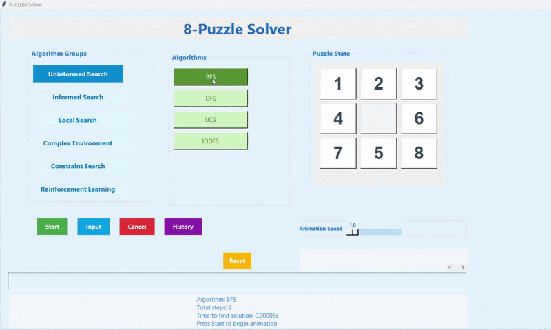
    
    * DFS 
    
    
    * IDDFS 
    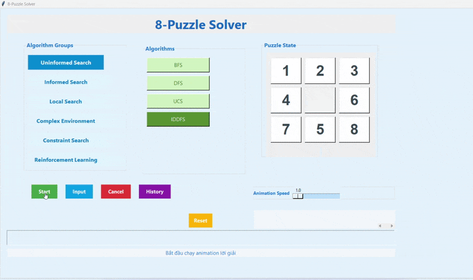
    
    * UCS 
    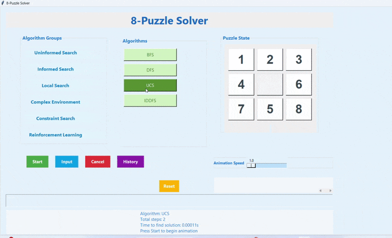

*   **So sánh hiệu suất:** (Bảng hoặc biểu đồ so sánh thời gian chạy, số bước, số node đã duyệt cho các bài toán mẫu)

*   **Nhận xét:** Các thuật toán tìm kiếm mù hoạt động tốt với không gian tìm kiếm nhỏ. BFS và IDDFS đảm bảo tìm thấy lời giải tối ưu (ít bước nhất), trong khi DFS có thể tìm thấy lời giải nhanh hơn nhưng không đảm bảo tối ưu. Tuy nhiên, với các bài toán phức tạp hơn hoặc độ sâu lời giải lớn, bộ nhớ và thời gian của BFS/UCS có thể trở thành vấn đề.

### 2.3. Các thuật toán Tìm kiếm có thông tin (Informed Search)

Nhóm này sử dụng hàm heuristic (ước lượng chi phí từ trạng thái hiện tại đến đích) để hướng dẫn quá trình tìm kiếm hiệu quả hơn.

*   **Các thuật toán đã triển khai:**
    *   **Tìm kiếm tham lam tốt nhất đầu tiên (Greedy Best-First Search):** Luôn mở rộng node được đánh giá là "gần đích nhất" theo heuristic. Nhanh nhưng không đảm bảo tối ưu.
    *   **Tìm kiếm A\* (A\* Search):** Kết hợp chi phí từ gốc và chi phí ước lượng đến đích (`f(n) = g(n) + h(n)`). Đảm bảo tối ưu nếu heuristic là nhất quán (consistent).
    *   **Tìm kiếm IDA\* (IDA\* Search - Iterative Deepening A\*):** Phiên bản lặp sâu dần của A\*, giúp tiết kiệm bộ nhớ so với A\* tiêu chuẩn.

*   **Hình ảnh GIF:**
    * Greedy Best-First Search 
    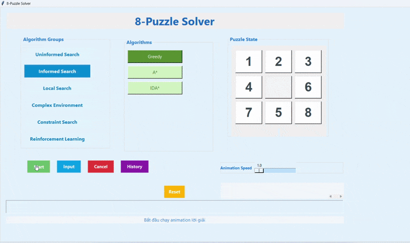
    
    * A* search 
    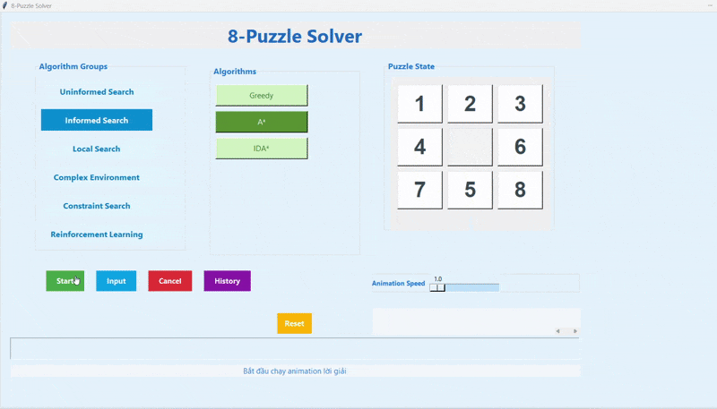
    
    * IDA* Search 
    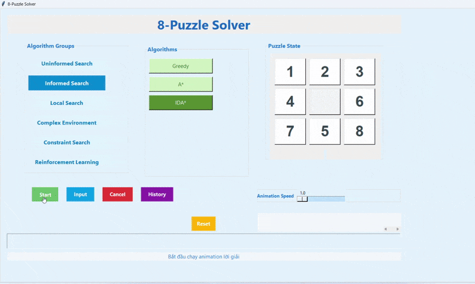

*   **So sánh hiệu suất:** (Bảng hoặc biểu đồ so sánh thời gian chạy, số bước, số node đã duyệt cho các bài toán mẫu)

*   **Nhận xét:** Với heuristic tốt (ví dụ: Manhattan distance, Hamming distance), các thuật toán tìm kiếm có thông tin thường vượt trội hơn tìm kiếm mù về hiệu quả thời gian và số node duyệt, đặc biệt trên không gian tìm kiếm lớn. A\* và IDA\* là các thuật toán tìm kiếm có thông tin phổ biến và mạnh mẽ.

### 2.4. Các thuật toán Tìm kiếm Cục bộ (Local Search)

Nhóm này bắt đầu từ một (hoặc nhiều) trạng thái hiện tại và di chuyển đến các trạng thái lân cận tốt hơn mà không lưu trữ toàn bộ đường đi. Thường dùng cho bài toán tối ưu hóa, không đảm bảo tìm được lời giải tối ưu toàn cục.

*   **Các thuật toán đã triển khai:** Hill Climbing (Simple, Steepest Ascent), Stochastic Hill Climbing, Simulated Annealing, Beam Search.

*   **Hình ảnh GIF:**
    
    * Hill Simple 
    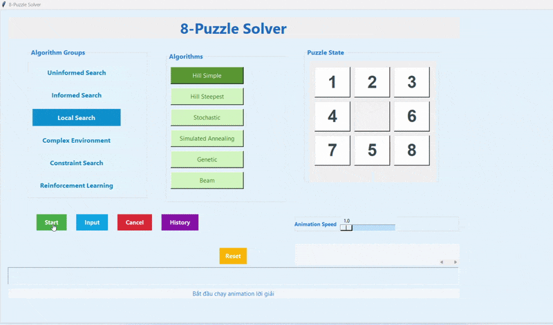
    
    * Hill Steepest 
    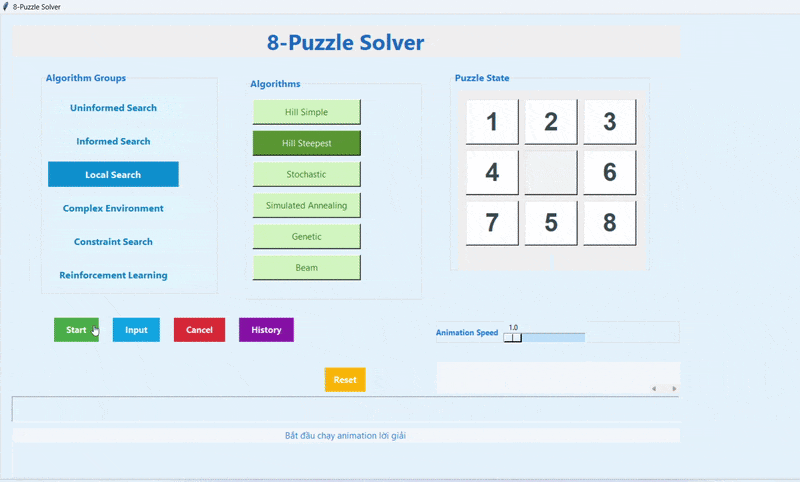
    
    * Stochastic 
    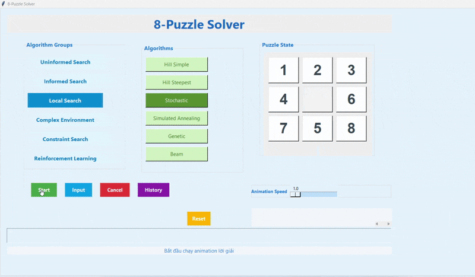
    
    * Simulateed Annealing 
    
    
    * Beam Search 
    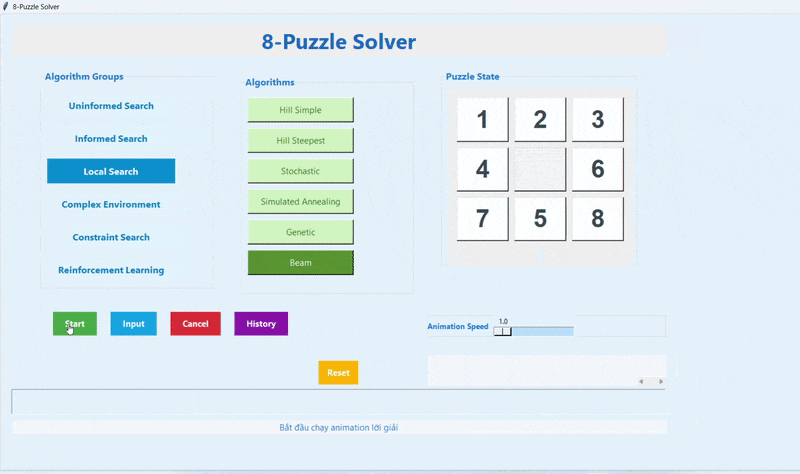
    
*   **So sánh hiệu suất:** (Bảng hoặc biểu đồ so sánh thời gian chạy, số bước, số node đã duyệt cho các bài toán mẫu)

*   **Nhận xét:** Tìm kiếm cục bộ có ưu điểm về bộ nhớ. Hill Climbing có thể bị mắc kẹt tại cực tiểu cục bộ. Simulated Annealing và Stochastic Hill Climbing cố gắng thoát khỏi cực tiểu cục bộ bằng cách cho phép di chuyển "xấu" với xác suất nhất định. Beam Search giữ lại `k` trạng thái tốt nhất ở mỗi bước.

### 2.5. Môi trường phức tạp (Complex Environment)

Bao gồm các bài toán hoặc thuật toán xử lý các môi trường không hoàn toàn quan sát được hoặc có yếu tố đối kháng/quyết định phức tạp.

*   **Các thuật toán đã triển khai:** AND-OR Search (cho bài toán có thể phân rã thành các bài toán con), Partial Observation, Non-Observation (Xử lý sự không chắc chắn về trạng thái).

*   **Visualization đặc thù:** (Quan trọng đối với phần này!)
    *   **AND-OR Tree Visualization:** Hiển thị cấu trúc cây AND-OR được tạo ra trong quá trình tìm kiếm, giúp theo dõi quá trình phân rã bài toán thành các bài toán con AND (cần giải tất cả) và OR (chỉ cần giải một trong số đó).
    *   Visualization cho Partial Observation và Non-Observation (nếu có, mô tả cách biểu diễn tập hợp trạng thái tin tưởng).

*   **Hình ảnh GIF / Video Demo:** (Visualization cây AND-OR, demo Partial/Non-Observation nếu có)

*   **Nhận xét:** Các thuật toán này phù hợp với các bài toán có cấu trúc đặc biệt hoặc có thông tin không đầy đủ, đòi hỏi cách tiếp cận khác với tìm kiếm truyền thống.

### 2.6. Tìm kiếm Ràng buộc (Constraint Search)

Giải các bài toán bằng cách tìm kiếm một trạng thái thỏa mãn một tập hợp các ràng buộc.

*   **Các thuật toán đã triển khai:** Backtracking (Tìm kiếm quay lui), Forward Checking (Kiểm tra tiến), AC-3 (Arc Consistency Algorithm 3).

*   **Hình ảnh GIF:**
    
    * Backtracking 
    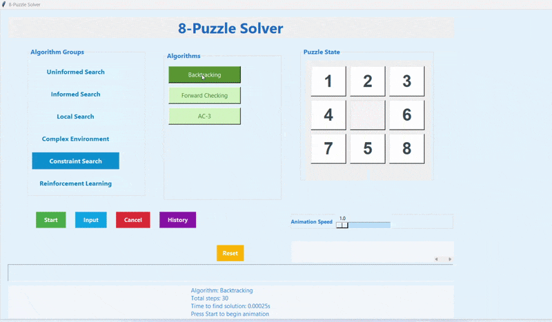
    
    * Forward Checking 
    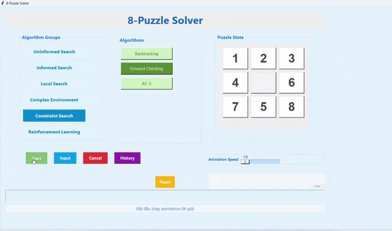
    
    * AC-3 
    

*   **So sánh hiệu suất:** (Bảng hoặc biểu đồ so sánh thời gian chạy, số bước, số node đã duyệt cho các bài toán mẫu)

### 2.7. Học tăng cường (Reinforcement Learning)

Học cách hành động trong một môi trường để tối đa hóa phần thưởng tích lũy.

*   **Các thuật toán đã triển khai:** Q-Learning.

*   **Hình ảnh GIF:**
    
    * Q-learning 
    

*   **So sánh hiệu suất:** (Bảng hoặc biểu đồ so sánh thời gian chạy, số bước, số node đã duyệt cho các bài toán mẫu)

*   **Nhận xét:** Q-Learning học giá trị hành động-trạng thái thông qua tương tác với môi trường. Cần thời gian huấn luyện nhưng có thể tìm ra các chiến lược hiệu quả.

## 3. Kết luận

Dự án đã thành công trong việc xây dựng một công cụ mạnh mẽ để khám phá và so sánh hiệu quả của nhiều thuật toán AI trên bài toán 8-Puzzle. Các kết quả đạt được bao gồm:

*   Ứng dụng GUI tương tác thân thiện, cho phép người dùng nhập trạng thái, chọn thuật toán và xem trực quan quá trình giải.
*   Triển khai đa dạng và đúng đắn các thuật toán tìm kiếm từ cơ bản đến nâng cao.
*   Khả năng trực quan hóa animation giúp hiểu rõ cách từng thuật toán hoạt động.
*   Đặc biệt, việc phát triển visualization cho các thuật toán phức tạp (như cây AND-OR) mang lại cái nhìn sâu sắc về cơ chế hoạt động bên trong.
*   Hệ thống lưu lịch sử giúp dễ dàng so sánh hiệu suất định lượng giữa các thuật toán.

Thông qua dự án này, người dùng có thể trực tiếp trải nghiệm và đánh giá ưu nhược điểm của từng thuật toán AI trong việc giải quyết một bài toán cụ thể, từ đó củng cố kiến thức lý thuyết một cách sinh động.

---

**Tác giả:** [Tên của bạn]
**Ngày hoàn thành:** [Ngày hoàn thành dự án]
**Công nghệ sử dụng:** Python, Tkinter, ...