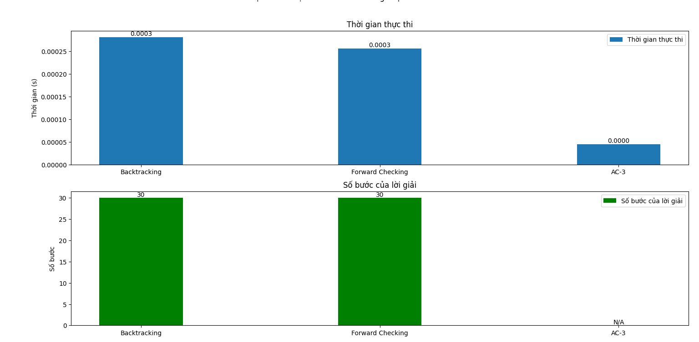

# Ứng dụng giải toán 8-Puzzle bằng các thuật toán Trí tuệ Nhân tạo

Dự án "8-Puzzle Solver" là một ứng dụng mô phỏng quá trình giải bài toán 8-Puzzle (Xếp hình 8 số) – một bài toán kinh điển trong lĩnh vực Trí tuệ Nhân tạo. Ứng dụng không chỉ đơn thuần tìm ra lời giải cho bài toán mà còn giúp người học và người dùng hiểu rõ hơn về cơ chế hoạt động của các thuật toán tìm kiếm thông qua hình ảnh minh họa, ma trận trạng thái, cây tìm kiếm, và thống kê hiệu suất.

## 1. Mục tiêu Dự án

Mục tiêu chính của dự án này là:
*   Xây dựng một ứng dụng đồ họa (GUI) cho phép người dùng tương tác với bài toán 8-Puzzle.
*   Triển khai và tích hợp đa dạng các thuật toán tìm kiếm (cả tìm kiếm mù, tìm kiếm có thông tin, tìm kiếm cục bộ, v.v.) để giải quyết bài toán.
*   Cung cấp khả năng trực quan hóa (animation) từng bước di chuyển của lời giải tìm được trên bảng Puzzle.
*   Xây dựng các công cụ visualization đặc thù cho các thuật toán phức tạp (như cây AND-OR cho AND-OR Search).
*   Lưu trữ và hiển thị lịch sử chạy thuật toán để so sánh hiệu suất.
*   Tạo ra một nền tảng giúp học hỏi và so sánh hiệu quả của các thuật toán AI khác nhau trên cùng một bài toán mẫu.

## 2. Nội dung Chính

Dự án bao gồm việc triển khai và trực quan hóa các nhóm thuật toán sau:

### 2.1. Bài toán 8-Puzzle: Thành phần và Lời giải

*   **Bài toán 8-Puzzle:** Là một bài toán tìm kiếm trạng thái cổ điển. Trạng thái của bài toán được biểu diễn bằng một ma trận 3x3 chứa 8 số (từ 1 đến 8) và một ô trống (biểu diễn bằng 0).
*   **Các thành phần chính:**
    *   **Trạng thái:** Ma trận 3x3 hiện tại của bảng Puzzle.
    *   **Hành động:** Các thao tác di chuyển ô trống: Lên (UP), Xuống (DOWN), Sang trái (LEFT), Sang phải (RIGHT). Các hành động chỉ hợp lệ nếu ô trống có thể di chuyển theo hướng đó.
    *   **Trạng thái ban đầu:** Cấu hình ban đầu của bảng Puzzle do người dùng nhập hoặc được đặt trước.
    *   **Trạng thái đích:** Cấu hình mong muốn cuối cùng của bảng Puzzle thường là trạng thái có các số từ 1 đến 8 sắp xếp tăng dần, với ô trống ở cuối.
.
*   **Lời giải:** Là một chuỗi các hành động hợp lệ liên tiếp, bắt đầu từ trạng thái ban đầu và dẫn đến trạng thái đích.

### 2.2. Các thuật toán Tìm kiếm không có thông tin (Uninformed Search)

Nhóm thuật toán này tìm kiếm lời giải mà không sử dụng bất kỳ thông tin bổ sung nào về "khoảng cách" từ trạng thái hiện tại đến trạng thái đích. Hiệu quả của chúng phụ thuộc vào cấu trúc của không gian tìm kiếm.

*   **Các thuật toán đã triển khai:**
    *   **Tìm kiếm theo chiều rộng (BFS - Breadth-First Search):** Tìm lời giải ngắn nhất (về số bước) trong không gian trạng thái.
    *   **Tìm kiếm theo chiều sâu (DFS - Depth-First Search):** Khám phá sâu nhất có thể theo mỗi nhánh trước khi quay lui.
    *   **Tìm kiếm chi phí đồng nhất (UCS - Uniform-Cost Search):** Mở rộng node có chi phí đường đi từ gốc thấp nhất (trong 8-Puzzle, chi phí mỗi bước thường là 1, nên UCS giống BFS).
    *   **Tìm kiếm theo chiều sâu lặp dần (IDDFS - Iterative Deepening Depth-First Search):** Kết hợp lợi ích bộ nhớ của DFS và tính đầy đủ/tối ưu của BFS.

*   **Hình ảnh GIF:**
    * BFS 
    
    
    
    * DFS 
    
    
    
    * IDDFS 
    
    
    
    * UCS 
    
    

*   **So sánh hiệu suất:**
    * Biểu đồ so sánh thời gian thực thi và số bước thực hiện của nhóm thuật toán Uninformed Search

    

*   **Nhận xét:** BFS, UCS và IDDFS đều giải được bài toán rất nhanh (≈ 0.0001 giây) và chỉ cần 2 bước để đạt trạng thái đích, chứng tỏ đây là những thuật toán tìm kiếm tối ưu và hiệu quả với không gian nhỏ. Trong khi đó, DFS (Standard) mất đến 1.5126 giây và phải duyệt qua 49,284 bước mới tìm được lời giải, cho thấy khả năng tìm kiếm không hiệu quả và không đảm bảo tối ưu. Điều này phản ánh đặc trưng của DFS là dễ rơi vào các nhánh sâu không cần thiết. Nhìn chung, BFS và IDDFS phù hợp để tìm lời giải ngắn và tối ưu nhưng có thể gặp giới hạn về bộ nhớ hoặc thời gian khi lời giải nằm sâu. DFS tiêu tốn ít bộ nhớ hơn nhưng không đảm bảo hiệu quả. UCS hoạt động giống BFS trong trường hợp chi phí đồng nhất và duy trì được sự tối ưu. Các thuật toán tìm kiếm mù chỉ phù hợp với không gian trạng thái nhỏ

### 2.3. Các thuật toán Tìm kiếm có thông tin (Informed Search)

Nhóm này sử dụng hàm heuristic (ước lượng chi phí từ trạng thái hiện tại đến đích) để hướng dẫn quá trình tìm kiếm hiệu quả hơn.

*   **Các thuật toán đã triển khai:**
    *   **Tìm kiếm tham lam tốt nhất đầu tiên (Greedy Best-First Search):** Luôn mở rộng node được đánh giá là "gần đích nhất" theo heuristic. Nhanh nhưng không đảm bảo tối ưu.
    *   **Tìm kiếm A\* (A\* Search):** Kết hợp chi phí từ gốc và chi phí ước lượng đến đích (`f(n) = g(n) + h(n)`). Đảm bảo tối ưu nếu heuristic là nhất quán (consistent).
    *   **Tìm kiếm IDA\* (IDA\* Search - Iterative Deepening A\*):** Phiên bản lặp sâu dần của A\*, giúp tiết kiệm bộ nhớ so với A\* tiêu chuẩn.

*   **Hình ảnh GIF:**
    
    * Greedy Best-First Search 
    
    
    
    * A* search 
    
    
    
    * IDA* Search 
    
    

*   **So sánh hiệu suất:**
    * Biểu đồ so sánh thời gian thực thi và số bước thực hiện của nhóm thuật toán Informed Search

    
*   **Nhận xét:** Biểu đồ trên thể hiện so sánh giữa các thuật toán tìm kiếm có thông tin (A*, IDA*, GBFS) dựa trên thời gian thực thi và số bước của lời giải trong bài toán 8-Puzzle. Kết quả cho thấy cả ba thuật toán đều có thời gian xử lý rất nhanh (khoảng 0.0001 giây), cho thấy khả năng tìm kiếm hiệu quả nhờ sử dụng heuristic. Trong đó, A* và GBFS chỉ cần 2 bước để tìm ra lời giải, chứng tỏ khả năng tìm kiếm tối ưu hoặc gần tối ưu khi sử dụng hàm heuristic tốt. Ngược lại, IDA* mất đến 4 bước, dù thời gian vẫn nhanh, cho thấy có thể phải lặp lại nhiều lần để đạt độ sâu phù hợp. Nhìn chung, với heuristic thích hợp như Manhattan hay Hamming distance, các thuật toán tìm kiếm có thông tin hoạt động hiệu quả hơn đáng kể so với các thuật toán tìm kiếm mù cả về tốc độ lẫn chất lượng lời giải, đặc biệt khi mở rộng sang không gian tìm kiếm lớn hơn. Trong đó, A* được đánh giá là thuật toán mạnh mẽ nhất vì đảm bảo tìm lời giải tối ưu với chi phí thấp nhất.

### 2.4. Các thuật toán Tìm kiếm Cục bộ (Local Search)

Nhóm này bắt đầu từ một (hoặc nhiều) trạng thái hiện tại và di chuyển đến các trạng thái lân cận tốt hơn mà không lưu trữ toàn bộ đường đi. Thường dùng cho bài toán tối ưu hóa, không đảm bảo tìm được lời giải tối ưu toàn cục.

*   **Các thuật toán đã triển khai:** Hill Climbing (Simple, Steepest Ascent), Stochastic Hill Climbing, Simulated Annealing, Beam Search.

*   **Hình ảnh GIF:**
    
    * Hill Simple 
    
    
    
    * Hill Steepest 
    
    
    
    * Stochastic 
    
    
    
    * Simulateed Annealing 
    
    
    
    * Beam Search 
    
    
    
*   **So sánh hiệu suất:**
    * Biểu đồ so sánh thời gian thực thi và số bước thực hiện của nhóm thuật toán Local Search
    
    

*   **Nhận xét:** Biểu đồ trên thể hiện hiệu suất của các thuật toán tìm kiếm cục bộ gồm: Hill Climbing (Simple, Steepest, Stochastic), Simulated Annealing và Beam Search, thông qua hai tiêu chí: thời gian thực thi và số bước của lời giải. Các thuật toán Hill Climbing (cả ba biến thể) và Beam Search đều giải bài toán chỉ với 2 bước và thời gian thực thi rất nhanh (gần như tức thời). Điều này phản ánh khả năng hội tụ nhanh khi xuất phát từ trạng thái thuận lợi. Tuy nhiên, Simulated Annealing tốn nhiều thời gian hơn đáng kể (~0.01s) và không giải được bài toán trong trường hợp này (N/A), cho thấy tính ngẫu nhiên có thể khiến thuật toán chậm hoặc không tìm được lời giải. Nhìn chung, các thuật toán tìm kiếm cục bộ có ưu điểm là tiêu tốn ít bộ nhớ, hoạt động nhanh, nhưng dễ bị mắc kẹt tại cực tiểu cục bộ. Để khắc phục, các biến thể như Stochastic Hill Climbing hoặc Simulated Annealing chấp nhận di chuyển "xấu" với xác suất nhằm thoát bẫy cực trị. Beam Search cải thiện bằng cách giữ nhiều trạng thái tốt nhất ở mỗi bước, giúp tránh rơi vào đường cụt. Đây là lựa chọn phù hợp trong các bài toán có không gian trạng thái lớn nhưng hạn chế bộ nhớ.

### 2.5. Môi trường phức tạp (Complex Environment)

Bao gồm các bài toán hoặc thuật toán xử lý các môi trường không hoàn toàn quan sát được hoặc có yếu tố đối kháng/quyết định phức tạp.

*   **Các thuật toán đã triển khai:** AND-OR Search (cho bài toán có thể phân rã thành các bài toán con), Partial Observation, Non-Observation (Xử lý sự không chắc chắn về trạng thái).

*   **Visualization đặc thù:** (Quan trọng đối với phần này!)
    *   **AND-OR Tree Visualization:** Hiển thị cấu trúc cây AND-OR được tạo ra trong quá trình tìm kiếm, giúp theo dõi quá trình phân rã bài toán thành các bài toán con AND (cần giải tất cả) và OR (chỉ cần giải một trong số đó).
    *   Visualization cho Partial Observation và Non-Observation (nếu có, mô tả cách biểu diễn tập hợp trạng thái tin tưởng).

*   **Hình ảnh GIF:**
    
    * AND-OR 
    
    
    
    * Partial Observation 
    
    
    
    * Non-Observation 
    
    

### 2.6. Tìm kiếm Ràng buộc (Constraint Search)

Giải các bài toán bằng cách tìm kiếm một trạng thái thỏa mãn một tập hợp các ràng buộc.

*   **Các thuật toán đã triển khai:** Backtracking (Tìm kiếm quay lui), Forward Checking (Kiểm tra tiến), AC-3 (Arc Consistency Algorithm 3).

*   **Hình ảnh GIF:**
    
    * Backtracking 
    
    
    
    * Forward Checking 
    
    
    
    * AC-3 
    
    

*   **So sánh hiệu suất:**
    * Biểu đồ so sánh thời gian thực thi và số bước thực hiện của nhóm thuật toán Constraint Search
    
    
*   **Nhận xét:** Biểu đồ thể hiện sự so sánh giữa ba thuật toán giải bài toán ràng buộc (CSP) gồm Backtracking, Forward Checking và AC-3, dựa trên thời gian thực thi và số bước lời giải. Kết quả cho thấy Backtracking và Forward Checking có thời gian thực thi gần như nhau (~0.0003s) và cùng cần 30 bước để tìm ra lời giải. Trong khi đó, AC-3 có thời gian thực thi nhanh hơn đáng kể (~0.0000s) nhưng không có dữ liệu về số bước lời giải do đây là thuật toán kiểm tra ràng buộc, không trực tiếp đưa ra lời giải hoàn chỉnh. Nhìn chung, Backtracking là phương pháp cơ bản dễ bị rơi vào duyệt toàn bộ không gian tìm kiếm nếu không có kỹ thuật cắt tỉa, còn Forward Checking giúp cải thiện hiệu suất bằng cách kiểm tra trước miền giá trị có thể của biến kế tiếp. AC-3 lại có ưu điểm trong việc loại bỏ các giá trị không hợp lệ trước, làm giảm đáng kể không gian tìm kiếm. Do đó, trong thực tế, việc kết hợp AC-3 với các thuật toán như Backtracking hoặc Forward Checking sẽ giúp giải quyết các bài toán ràng buộc hiệu quả hơn.
### 2.7. Học tăng cường (Reinforcement Learning)

Học cách hành động trong một môi trường để tối đa hóa phần thưởng tích lũy.

*   **Các thuật toán đã triển khai:** Q-Learning.

*   **Hình ảnh GIF:**
    
    * Q-learning 
    
    

*   **So sánh hiệu suất:**
    * Biểu đồ hiệu suất của Q-learning
    
    

*   **Nhận xét:** Biểu đồ minh họa hiệu quả của thuật toán Q-Learning với các cấu hình khác nhau của hệ số học (α) và xác suất khai phá (ε). Các cấu hình với ε = 0.1 hoặc 0.3 đều cho kết quả tốt, với thời gian thực thi dao động từ 0.0216s đến 0.0244s và số bước giải là 2 sau 2000 tập huấn luyện (episodes). Ngược lại, các cấu hình có ε = 0.5 không thu được kết quả (N/A), cho thấy khi mức độ khai phá quá cao, thuật toán khó hội tụ về chính sách tối ưu. Điều này cho thấy Q-Learning cần được tinh chỉnh hợp lý giữa khai phá và khai thác để đảm bảo học hiệu quả. Dù mất thời gian huấn luyện, nhưng khi đã học xong, Q-Learning có thể đưa ra chiến lược tối ưu với hiệu suất cao và ổn định.

## 3. Kết luận

Dự án đã thành công trong việc xây dựng một công cụ mạnh mẽ để khám phá và so sánh hiệu quả của nhiều thuật toán AI trên bài toán 8-Puzzle. Các kết quả đạt được bao gồm:

*   Ứng dụng GUI tương tác thân thiện, cho phép người dùng nhập trạng thái, chọn thuật toán và xem trực quan quá trình giải.
*   Triển khai đa dạng và đúng đắn các thuật toán tìm kiếm từ cơ bản đến nâng cao.
*   Khả năng trực quan hóa animation giúp hiểu rõ cách từng thuật toán hoạt động.
*   Đặc biệt, việc phát triển visualization cho các thuật toán phức tạp (như cây AND-OR) mang lại cái nhìn sâu sắc về cơ chế hoạt động bên trong.
*   Hệ thống lưu lịch sử giúp dễ dàng so sánh hiệu suất định lượng giữa các thuật toán.

### Thuật toán nhanh nhất

Trong số các thuật toán được triển khai, **A*** và **Greedy Best-First Search (GBFS)** là hai thuật toán nhanh nhất, với thời gian thực thi gần như tức thời (~0.0001 giây). Điều này đạt được nhờ việc sử dụng hàm heuristic để hướng dẫn quá trình tìm kiếm, giúp giảm đáng kể số lượng trạng thái cần duyệt. 

* **A***: Đảm bảo tìm được lời giải tối ưu nhờ kết hợp chi phí từ gốc và chi phí ước lượng đến đích (`f(n) = g(n) + h(n)`).
* **GBFS**: Tập trung vào việc mở rộng trạng thái "gần đích nhất" theo heuristic, tuy nhiên không đảm bảo tối ưu.

Nhìn chung, **A*** là thuật toán mạnh mẽ nhất vì vừa nhanh vừa đảm bảo tìm được lời giải tối ưu, đặc biệt khi sử dụng heuristic tốt như Manhattan.

---
[Trần Minh Quận] - MSSV: 23110295

